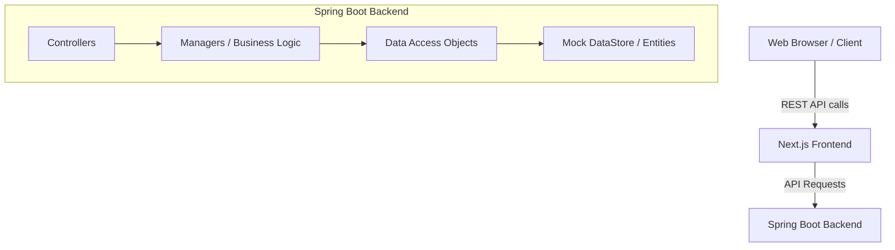

<div align="center">
  <h1>🦚 Pavo - Flaunt Your Academic Feathers</h1>
  <p><strong>The future of educational counselling: a comprehensive platform designed to help the youth navigate their academic and career paths with confidence.</strong></p>

  <p>
    <a href="https://nextjs.org/"></a>
    <a href="https://spring.io/projects/spring-boot"></a>
    <a href="https://www.typescriptlang.org/"></a>
    <a href="https://tailwindcss.com/"></a>
    <a href="https://www.java.com/"></a>
    <a href="https://www.docker.com/"></a>
  </p>

  <h3>
    <a href="https://pavo-flaunt-your-academic-feathers.vercel.app/">View Live Demo</a>
    <span> | </span>
    <a href="#features">Explore Features</a>
    <span> | </span>
    <a href="#getting-started">Get Started</a>
  </h3>
</div>

<hr />

## 📖 Overview

Originally conceived as a high-impact college hackathon project, **Pavo** has evolved into a full-fledged N-tier web application. It acts as a one-stop educational companion, helping students discover universities, find relevant scholarships, plan extensive career roadmaps, and predict their admission chances based on real-world metrics.

## ✨ Features

- 🏛️ **College Directory:** Explore universities, deep-dive into available courses, review tuition fees, and understand admission criteria.
- 🎓 **Scholarship Finder:** Discover scholarships tailored to specific academic levels, financial backgrounds, and merits.
- 🚀 **Career Roadmaps:** Navigate step-by-step career paths. Includes salary expectations, required skills, and growth trajectories for various professions.
- 🔮 **Admission Predictor:** Estimate the probability of admission to top-tier colleges based on user academic profiles.
- 🤝 **Mentorship & Community:** Connect with peers, alumni, and verified mentors for guidance.
- 🤖 **Interactive Quizzes & Chatbot:** Engage with our smart assistant for on-the-go help and assess your aptitude through interactive quizzes.

## 🏗️ Architecture & Tech Stack

Pavo is built on a modern decoupled architecture, ensuring scalability, maintainability, and a seamless developer experience.

### System Architecture



### 🎨 Frontend (Next.js)
- **Core Framework**: [Next.js 14](https://nextjs.org/) (React 18) utilizing the App Router.
- **Language**: TypeScript for end-to-end type safety.
- **Styling**: Tailwind CSS for utility-first styling.
- **UI Components**: Radix UI primitives for accessible, unstyled components, brought to life with Framer Motion and Tailwind-animate.
- **Data Visualization**: Recharts for dynamic and interactive charts.
- **Forms & Validation**: React Hook Form coupled with Zod.

### ⚙️ Backend (Spring Boot)
- **Core Framework**: [Spring Boot](https://spring.io/projects/spring-boot).
- **Language**: Java 17.
- **Design Pattern**: N-Tier Architecture (Controllers → Managers → DAOs) ensuring a clean separation of concerns.
- **Data Layer**: Currently backed by an in-memory `DataStore` for rapid prototyping, easily swappable with a JPA/Hibernate implementation for production.
- **Containerization**: Dockerfile provided for streamlined deployment.

## 🚀 Getting Started

Follow these steps to set up the project locally on your machine.

### Prerequisites

Ensure you have the following installed:
- [Node.js](https://nodejs.org/) (v18.x or higher)
- [Java Development Kit (JDK) 17](https://adoptium.net/)
- [Maven](https://maven.apache.org/) (or use the wrapper)
- [Docker](https://www.docker.com/) (Optional, if you wish to run the backend in a container)

### 1. Start the Spring Boot Backend

The backend exposes the RESTful APIs required by the frontend application.

```bash
# Navigate to the backend directory
cd backend

# Run the application using Maven
mvn spring-boot:run
```

> **Note:** The backend runs on port `8080` by default.

#### (Optional) Running Backend via Docker
```bash
cd backend
docker build -t pavo-backend .
docker run -p 8080:8080 pavo-backend
```

### 2. Start the Next.js Frontend

The frontend application provides the interactive user interface.

```bash
# Navigate to the project root directory
# Install all required npm dependencies
npm install

# Start the development server
npm run dev
```

The frontend will start on port `3000`. Open [http://localhost:3000](http://localhost:3000) in your browser to view the application.

## 📁 Project Structure

```text
Pavo-Flaunt-Your-Academic-Feathers/
├── app/                  # Next.js App Router (Pages, Layouts, API routes if any)
├── backend/              # Spring Boot Java Application
│   ├── src/main/java/    # Core Java source (Entities, DAOs, Managers, Controllers)
│   ├── pom.xml           # Maven configuration
│   └── Dockerfile        # Docker build instructions
├── components/           # Reusable UI components (Radix, custom components)
├── lib/                  # Frontend utilities, hooks, and configurations
├── public/               # Static assets (images, fonts, icons)
├── styles/               # Global CSS and Tailwind configurations
└── package.json          # Node.js dependencies and scripts
```

## 🤝 Contributing

We welcome contributions from the community! Whether you want to fix a bug, improve documentation, or add a new feature, your help is appreciated.

1. **Fork** the repository.
2. **Create a new branch** (`git checkout -b feature/amazing-feature`).
3. **Commit your changes** (`git commit -m 'Add some amazing feature'`).
4. **Push to the branch** (`git push origin feature/amazing-feature`).
5. **Open a Pull Request**.

Please ensure your code adheres to the existing style and all tests pass before submitting your PR.

## 📄 License

This project is open-source and available under the MIT License.
